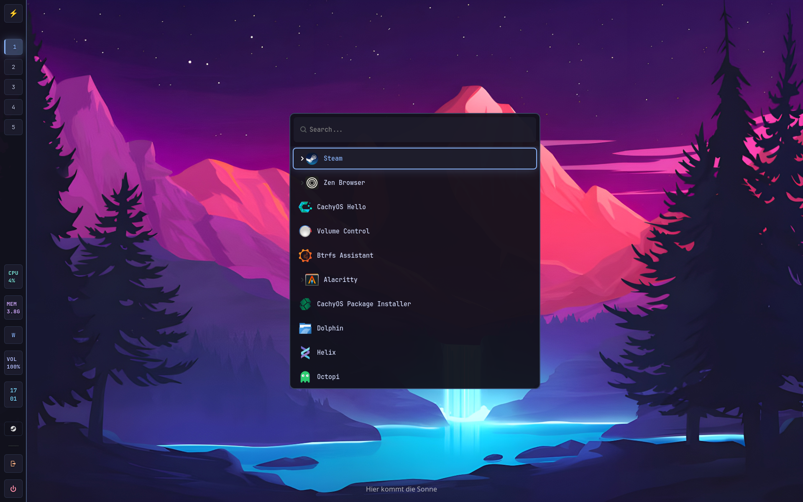

# Hyprland Dotfiles — Tokyo Night · Wayland Tiling WM · CachyOS / Arch Linux

[](https://github.com/hyprwm/Hyprland)
[](https://github.com/Alexays/Waybar)
[](LICENSE)
[](https://cachyos.org)
[](https://github.com/mehdi-hossaini/dotfiles/stargazers)

> A production-ready, daily-driver **Hyprland configuration** for **CachyOS** and **Arch Linux** — featuring the **Tokyo Night Dark** theme, a vertical **Waybar** with live Cava visualizer, 130+ pre-configured window rules, a Wofi power menu & WiFi manager, a Kitty dropdown terminal, and a one-command automated installer that also tunes your network stack and NVMe I/O scheduler.



---

## 📑 Table of Contents

- [Overview](#-overview)
- [What's Included](#-whats-included)
- [Features](#️-features)
- [Quick Start (One Command)](#-quick-start-one-command)
- [Post-Install Configuration](#-post-install-configuration)
- [Keybinds](#️-keybinds)
- [Visual Design](#-visual-design)
- [Components & Config Files](#-components--config-files)
- [Required Packages](#-required-packages)
- [Supported Applications (130+)](#-supported-applications-window-rules)
- [Daily Use — Mouse vs Keyboard](#-daily-use--mouse-vs-keyboard)
- [Topics](#️-topics)

---

## � Overview

This is a **complete, opinionated Hyprland rice** built for fast, focused desktop use. It targets **CachyOS** (Arch-based, performance-first) with the Hyprland edition but works on any Arch Linux installation.

**What makes it stand out:**

- 🎨 Consistent **Tokyo Night Dark** color palette across every component (Hyprland borders, Waybar, Wofi, Kitty, Dunst)
- 🚀 One-script install that handles mirrors, packages, configs, networking tuning, and NVMe scheduler
- 🖥️ **Vertical left-side Waybar** with Cava audio visualizer, workspace icons, CPU/RAM/network stats
- 🪟 **2988-line** `hyprland.conf` with 130+ named window rules — dialogs, floating, PiP, games auto-handled
- 📟 **Dropdown terminal** (Kitty) that slides down from the top with `Super+Shift+T`
- ⚡ Network stack tuned: **BBR congestion control + CAKE qdisc** — noticeably better throughput on wifi
- 💾 **ADIOS I/O scheduler** for NVMe drives (lower latency, better for desktop workloads)

> [!CAUTION]
> Best used on a **fresh [CachyOS](https://cachyos.org/) installation** (Hyprland edition). Applying on top of an existing Hyprland config may overwrite your settings.

---

## 📦 What's Included

```
dotfiles/
├── setup.sh                   # Fully automated install script
├── hello.jpg                  # Default wallpaper
└── experimental/
    ├── hypr/
    │   ├── hyprland.conf      # 2988-line master config (rules, keybinds, theme, input)
    │   ├── hyprpaper.conf     # Wallpaper setup
    │   └── scripts/
    │       ├── kitty-dropdown.sh    # Dropdown terminal toggle
    │       └── kde-dark-mode.sh    # GTK/Qt dark mode applicator
    ├── waybar/
    │   ├── config.jsonc       # Vertical bar — workspaces, Cava, stats, power
    │   ├── style.css          # Tokyo Night Premium CSS (349 lines)
    │   └── scripts/
    │       └── cava.sh        # Cava audio visualizer bridge
    ├── wofi/
    │   ├── config             # Fuzzy launcher config
    │   ├── style.css          # Matching wofi theme
    │   └── scripts/
    │       ├── power.sh       # Lock / Logout / Suspend / Reboot / Shutdown
    │       └── wifi.sh        # Interactive WiFi menu via nmcli
    ├── kitty/
    │   └── kitty.conf         # Catppuccin Mocha, tabs, splits, opacity, blur
    ├── dunst/                 # Notification daemon config
    ├── fish/
    │   ├── config.fish        # Shell init
    │   └── welcome.sh         # Startup greeting / system info
    ├── btop/                  # Resource monitor theme
    └── helix/                 # Modal text editor config
```

---

## ⚙️ Features

| Category | Detail |
|----------|--------|
| **Theme** | Tokyo Night Dark — consistent across all components |
| **Bar** | Vertical left-side Waybar, 65px wide, with Cava in center |
| **Workspaces** | 6 persistent workspaces with Nerd Font icons (browser, code, chat, discord, game, 🎮) |
| **Tiling Layout** | Dwindle — 6px inner / 12px outer gaps, 10px rounded corners |
| **Window Rules** | 130+ named rules — floating dialogs, PiP, games fullscreen, Steam, IDE popups |
| **Borders** | Blue→Purple gradient on active, dimmed bg on inactive |
| **Performance** | Animations disabled, VRR + VFR enabled, `allow_tearing = true` for gaming |
| **Networking** | BBR TCP + CAKE qdisc automatically tuned per interface |
| **I/O** | ADIOS scheduler on NVMe — persistent via udev rule |
| **Notifications** | Dunst with matching Tokyo Night style |
| **Terminal** | Kitty — Catppuccin Mocha, 92% opacity, background blur, tabs, splits |
| **Launcher** | Wofi — fuzzy search, icons, 450×320, center-screen |
| **Shell** | Fish with custom welcome banner and completions |
| **Editor** | Helix (modal, terminal-based) |
| **System Monitor** | Btop with matching theme |
| **Portals** | `xdg-desktop-portal-hyprland` fully configured |
| **Auth** | `polkit-kde-agent` with float + center window rule |
| **Cursor** | Breeze cursor, 24px, auto-hide after 5s, hides on keypress |
| **GTK/Qt** | Both forced to dark via gsettings + KDE env vars |

---

## 🚀 Quick Start (One Command)

> [!IMPORTANT]
> Run this on a **fresh CachyOS Hyprland install**. The script runs `cachyos-rate-mirrors` which is CachyOS-specific.

```bash
git clone https://github.com/mehdi-hossaini/dotfiles.git ~/dotfiles
cd ~/dotfiles
chmod +x setup.sh
./setup.sh
```

**The script automatically:**

1. Updates mirror list (`cachyos-rate-mirrors`)
2. Full system upgrade (`pacman -Syu`)
3. Installs all required packages
4. Clones / updates this repo
5. Copies all configs to `~/.config/`
6. Copies wallpaper to `~/Pictures/`
7. Enables **BBR + CAKE** networking via sysctl
8. Disables `ananicy-cpp` (conflicts with manual tuning)
9. Sets **ADIOS** I/O scheduler on all NVMe drives + udev persistence
10. Sets script permissions for all helper scripts
11. Runs the KDE dark mode script
12. Prints post-setup instructions and prompts for reboot

---

## 🔧 Post-Install Configuration

After rebooting into Hyprland, run these two commands as needed:

### 1. Auto-Detect Your Monitor

```bash
sed -i 's/^monitor = .*/monitor = , preferred, auto, auto/' ~/.config/hypr/hyprland.conf
```

### 2. Set Your Keyboard Layout

The default is `se` (Swedish). Replace with your layout code:

```bash
sed -i 's/kb_layout = se/kb_layout = us/' ~/.config/hypr/hyprland.conf
```

Common layout codes: `us` · `gb` · `de` · `fr` · `es` · `no` · `fi` · `dk`

> [!TIP]
> Log out and back in (or `Super+Shift+E` then re-login) to apply all changes.

---

## ⌨️ Keybinds

All keybinds use `SUPER` (Windows key) as the modifier.

### 🪟 Window Management

| Key | Action |
|-----|--------|
| `SUPER + Enter` | Open terminal (Kitty) |
| `SUPER + B` | Open Zen Browser |
| `SUPER + E` | Open file manager (Dolphin) |
| `SUPER + D` | Launch app launcher (Wofi) |
| `SUPER + Q` | Close focused window |
| `SUPER + V` | Toggle floating mode |
| `SUPER + F` | Toggle fullscreen |
| `SUPER + Shift + T` | Toggle dropdown terminal (slides from top) |
| `SUPER + Shift + E` | Exit Hyprland session |

### 🧭 Navigation & Workspaces

| Key | Action |
|-----|--------|
| `SUPER + ←/→/↑/↓` | Move focus between windows |
| `SUPER + Shift + ←/→/↑/↓` | Move window in layout |
| `SUPER + 1–6` | Switch to workspace 1–6 |
| `SUPER + 7–0` | Switch to workspace 7–10 |
| `Alt + Tab` | Cycle next in group |

### 🛠️ Utilities & Scripts

| Key | Action |
|-----|--------|
| `SUPER + Backspace` | Power menu (Lock / Logout / Suspend / Reboot / Shutdown) |
| `SUPER + N` | WiFi menu (connect/disconnect via nmcli) |
| `Print` | Screenshot → saved to file |
| `SUPER + Print` | Area screenshot → saved to file |
| `Shift + Print` | Area screenshot → copied to clipboard |

### 🔊 Media & System

| Key | Action |
|-----|--------|
| `Volume Up / Down` | ±3% volume |
| `Brightness Up / Down` | ±5% brightness (`brightnessctl`) |
| `Play / Pause / Next / Prev` | Media playback (`playerctl`) |

### 🖱️ Mouse Binds

| Action | Result |
|--------|--------|
| `SUPER + LMB drag` | Move floating window |
| `SUPER + RMB drag` | Resize window |
| `SUPER + Scroll` | Cycle workspace |
| Drag border (20px grab area) | Resize any tiled window |

---

## 🎨 Visual Design

The setup uses **Tokyo Night Dark** as the master palette, applied consistently everywhere:

| Element | Color | Role |
|---------|-------|------|
| Active border | `#7aa2f7` → `#bb9af7` (45° gradient) | Blue-to-purple, shows focused window |
| Inactive border | `#24283b` at 87% opacity | Dark, recedes |
| Waybar background | `rgba(26,27,38,0.88)` | Semi-transparent dark |
| CPU module | `#7dcfff` (cyan) | Cool tone for processing |
| RAM module | `#bb9af7` (purple) | Violet accent |
| Network module | `#7aa2f7` (blue) | Connectivity |
| Volume module | `#ff9e64` (orange) | Audio |
| Clock | `#c0caf5` (soft white) | Always readable |
| Tray | `#9ece6a` (green) | System health indicator |
| Power buttons | Yellow (logout) + Red (shutdown) | Clear danger hierarchy |

**Key visual effects:**
- 🔲 **10px corner rounding** on all windows
- 🌫️ **0.95 terminal opacity** — content without losing context awareness
- 🌊 **Cava audio visualizer** rotated vertically in the center of the bar — reactive to your music
- 💡 **Hover glow** on Waybar modules (box-shadow pulse)
- 🔴 **Urgent workspace** pulsing red animation
- 🖱️ **Cursor auto-hides** after 5s inactivity and on keypress

---

## 🧩 Components & Config Files

### Hyprland (`experimental/hypr/hyprland.conf`)
The main 2988-line monolithic config. Sections:
- **Environment variables** — Wayland, GTK, Qt, SDL, Electron, Java all forced to Wayland
- **Startup sequence** — DBus → polkit → Pipewire → Dunst → XDG portal → Hyprpaper → `sleep 1 && waybar`
- **General + decoration** — gaps, borders, 10px rounding, shadow enabled, blur disabled (performance)
- **Animations** — defined but disabled (`enabled = no`); bezier curves ready to enable
- **Input** — touchpad scroll factor 0.5, tap-to-click, flat acceleration profile
- **Misc** — VFR, VRR, terminal swallow, focus-on-activate, disable logo
- **Window rules** — 130+ named rules covering browsers, terminals, DEs, IDEs, games, media

### Waybar (`experimental/waybar/`)
- **Position:** Left-side vertical bar, 65px wide
- **Left panel:** CachyOS logo button (click → Wofi) + workspace switcher
- **Center:** Cava audio bars (rotated 90°, real-time)
- **Right panel:** CPU %, RAM GB, Network icon, Volume %, Clock (HH/MM), Tray, Logout, Power
- **Style:** 349-line Tokyo Night CSS with `@keyframes urgentPulse` and `fadeIn` animations

### Kitty (`experimental/kitty/kitty.conf`)
- **Font:** JetBrains Mono Nerd Font, 12px, ligatures enabled
- **Theme:** Catppuccin Mocha (blue/lavender/teal palette)
- **Opacity:** 92% background + 24px background blur
- **Layouts:** splits, stack, tall — switch with `Ctrl+Shift+L`
- **Tabs:** Powerline slanted style, shown only when 2+ tabs open
- **Scrollback:** 10,000 lines
- **Remote control:** Enabled via Unix socket (used by dropdown script)

### Wofi (`experimental/wofi/`)
- Fuzzy case-insensitive search, 450×320, centered
- App icons enabled (24px), scrollbar hidden
- Power menu script: Lock → Logout → Suspend → Reboot → Shutdown
- WiFi menu script: scan + connect/disconnect via `nmcli`

### Fish Shell (`experimental/fish/`)
- Minimal `config.fish` — fast startup
- `welcome.sh` — rich system info displayed on new terminal (OS, kernel, WM, uptime, etc.)

---

## 📋 Required Packages

All installed automatically by `setup.sh` via `pacman`:

| Package | Purpose |
|---------|---------|
| `hyprland` | Wayland tiling compositor |
| `kitty` | GPU-accelerated terminal |
| `dolphin` | KDE file manager |
| `dunst` | Notification daemon |
| `hyprpaper` | Wallpaper daemon |
| `waybar` | Status bar |
| `wofi` | Application launcher |
| `polkit-kde-agent` | Authentication agent |
| `brightnessctl` | Backlight control |
| `playerctl` | Media key control |
| `pipewire` + `pipewire-pulse` + `wireplumber` | Audio stack |
| `hicolor-icon-theme` | Base icon theme |
| `qt5-wayland` + `qt6-wayland` | Qt Wayland integration |
| `xdg-desktop-portal-hyprland` | Screen sharing, file pickers |
| `ttf-jetbrains-mono-nerd` | Primary font (Nerd Font icons) |
| `cachyos-gaming-meta` | Gaming optimizations meta-package |
| `steam` | Game platform |
| `grim` + `slurp` | Wayland screenshot tools |
| `wl-clipboard` | Clipboard manager (Wayland) |
| `cava` | Audio visualizer |

**Also recommended (install manually):**
- `zen-browser` — default browser configured in keybinds
- `fish` — configured shell
- `btop` — system monitor (config included)
- `helix` — editor (config included)
- `hyprlock` — screen locker (used by power menu)
- `pavucontrol` — audio control GUI (click on volume module)
- `nmcli` (part of `networkmanager`) — used by WiFi menu script

---

## 📱 Daily Use — Mouse vs Keyboard

This setup is **keyboard-optimized but fully mouse-usable**:

| Task | Keyboard | Mouse |
|------|----------|-------|
| Open app | `Super+D` (Wofi) | Click CachyOS logo on Waybar |
| Switch workspace | `Super+1–6` | Click workspace button on Waybar |
| Move window | `Super+Shift+Arrows` | `Super+LMB` drag |
| Resize window | Drag border (20px grab zone) | `Super+RMB` drag |
| Take screenshot | `Print` / `Super+Print` | — |
| Power actions | `Super+Backspace` | Click shutdown button on Waybar |
| Volume control | Media keys | Click volume module → Pavucontrol |
| Open terminal | `Super+Enter` | — |
| Dropdown terminal | `Super+Shift+T` | — |

> **Verdict:** Keyboard shortcuts make workflows *much* faster, but every critical action (launch, power, workspace, volume) is also reachable with a mouse click on Waybar. This is a true daily-driver setup — no Vi-mode required.

---

## 🗃️ Supported Applications (Window Rules)

<details>
<summary>View all 130+ applications with pre-configured window rules</summary>

> [!NOTE]
> These applications are **not installed** by the setup script. Only their window rules are pre-configured. Install what you need separately.

- **Browsers:** Firefox, Zen Browser (alpha/beta/stable), Chrome, Chromium, Brave, LibreWolf, Vivaldi, Opera, Thorium
- **Terminals:** Kitty (+ dropdown), Alacritty, Foot, Wezterm, Ghostty, Contour
- **File Managers:** Dolphin (10+ dialog rules), Nautilus, Thunar, PCManFM, Nemo, Caja, Krusader, Double Commander, Ranger
- **IDEs & Editors:** VSCode, VSCodium, all JetBrains IDEs (incl. Android Studio), Zed, Neovide, Emacs, Sublime Text, Kate, Helix
- **Dev Tools:** DBeaver, TablePlus, Beekeeper Studio, Insomnia, Postman, GitKraken, GitG, KiCad
- **Communication:** Discord/Vesktop/WebCord, Slack, Microsoft Teams, Telegram, Signal, WhatsApp, Element, Fluffychat, Nheko, Fractal, Hexchat, Jami
- **Email:** Thunderbird, Betterbird, Evolution, KMail
- **Media Players:** Spotify/ncspot, VLC, MPV, Celluloid, Lollypop, Rhythmbox, Clementine, Strawberry, Audacity, Haruna, Kaffeine
- **Video Production:** OBS, Kdenlive, Openshot, Shotcut, DaVinci Resolve
- **Gaming:** Steam (main + Friends + Big Picture + games fullscreen), Lutris, Heroic, Bottles, PrismLauncher, Minecraft, CS2, Valorant, Wine/Proton, MangoHUD, GameScope, Gamescope, itch.io
- **Creative Tools:** GIMP, Inkscape, Krita, Blender, Darktable, RawTherapee, Digikam, Shotwell
- **Office & Docs:** LibreOffice, OnlyOffice, WPS Office, Calibre, Evince, Okular, Zathura, Joplin
- **VMs & Remote:** Virt-Manager, VirtualBox, Remmina, Looking Glass, AnyDesk, RustDesk
- **System Tools:** Pavucontrol, NetworkManager, Bluetooth, KCalc, GParted, Timeshift, Font Manager, GNOME Monitors, Btop, Htop, KsysGuard, KSystemLog, HardInfo, Baobab, Disks
- **Package Managers:** Octopi, Pamac, Update Manager
- **KDE Utilities:** KDE Partition Manager, KTorrent, KStars (fullscreen), Kalzium, KDE Connect, KDialog
- **CachyOS Specific:** CachyOS Hello, CachyOS Pi, BTRFS Assistant
- **Extras:** Swappy, Flameshot, Insync, Hydrogen (audio), Hypnotix (IPTV), Joplin, NetBeans

</details>

---

## 🏷️ Topics

`hyprland` `dotfiles` `wayland` `arch-linux` `cachyos` `tokyo-night` `ricing` `tiling-window-manager` `waybar` `wofi` `kitty` `linux` `desktop-setup` `hyprland-config` `hyprland-theme` `cava` `fish-shell` `dunst` `performance` `gaming`
